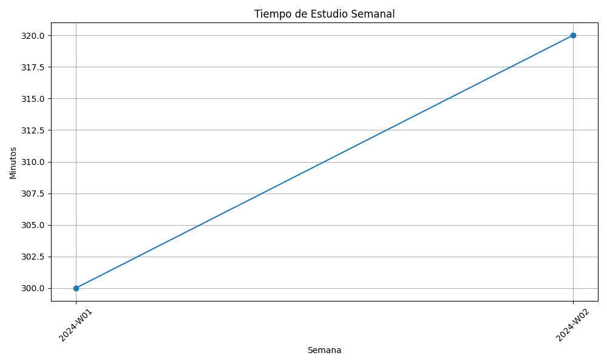

# English Learning Tracker 2025

## Overview
Personal English learning progress tracking system.

## Structure
- 📂 objectives: Learning goals and milestones
- 📂 progress: Weekly and monthly tracking
- 📂 learning: Study materials and practice
- 📂 diary: Daily learning logs
- 📂 resources: Study resources and links

## Quick Start
1. Check objectives/main-goals.md for current goals
2. Use issue templates for daily practice
3. Review weekly progress reports
4. Update learning materials regularly

## Progress Tracking

